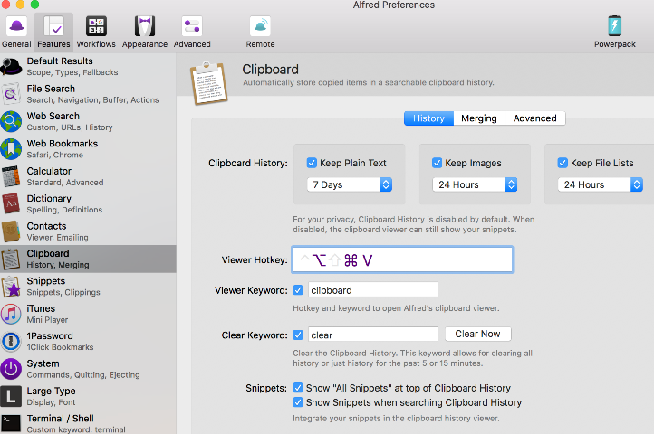
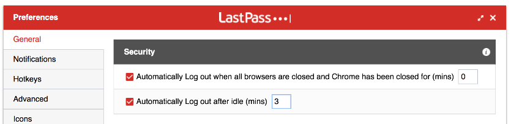
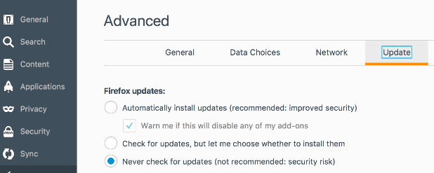
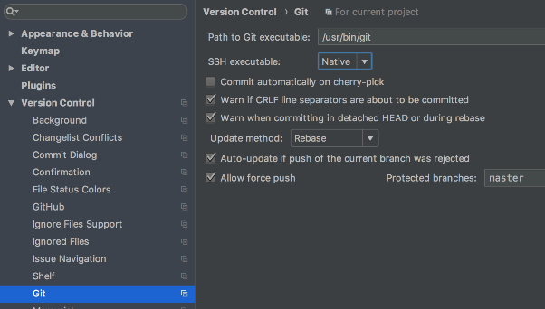
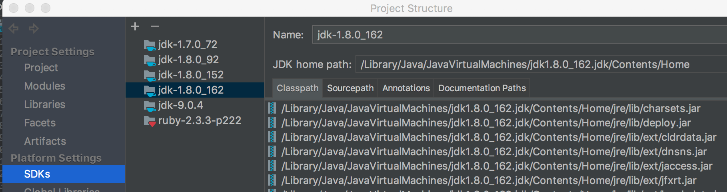
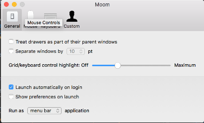
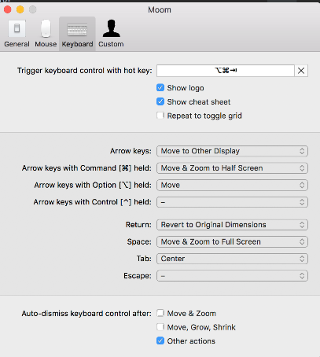

# Mac Setup

First: [install macOS](https://github.com/pgpx/mac-setup/blob/master/macOS%20USB%20install.md)

Other setup notes:
* <https://mattstauffer.com/blog/setting-up-a-new-os-x-development-machine-part-1-core-files-and-custom-shell/>
* <https://computers.tutsplus.com/tutorials/perfect-configurations-with-homebrew-and-cask--cms-20768>


## System Preferences

* Bluetooth
    * Add devices
* Dock
    * Automatically hide and show the Dock - check
* General
    * Use dark menu bar and Dock - check
* Internet Accounts
    * Configure Google, etc.
* Keyboard
    * Keyboard
        * Show keyboard and emoji viewers in the menu bar
        * Customise control strip... - Mute, Lock, Volume, Dashboard
    * Text
        * Correct spelling automatically - uncheck
        * Capitalize words automatically - uncheck
        * Add period with double-space - uncheck
    * Shortcuts
        * Mission Control
            * Mission Control  - uncheck (conflicts with Sublime Text)
            * Application windows - uncheck (conflicts with Sublime Text)
            * Move left a space (conflicts with a lot!)
            * Move right a space (conflicts with a lot!)
        * Function Keys - add IntelliJ Idea and Microsoft Remote Desktop
    * Dictation
        * Shortcut - off
* Security & Privacy
    * FileVault -> Turn On
    * Firewall -> Turn On Firewall
* Trackpad
    * Point & Click
        * Tap to click - check
* Users & Groups
    * Disable Guest User
    * Change user icon (by clicking on it)

## O/S Basic Setup

1. Install O/S Updated from App Store
1. Install purchased apps from App Store
1. Run Xcode and accept the license (either manually or automatically using `sudo xcodebuild -license` ([SO](http://stackoverflow.com/a/26772631/125246)))
1. Install device drivers
    * Ethernet drivers
        * <http://blog.fosketts.net/2016/10/22/usb-ethernet-not-working-macos-10-12-sierra/>
        * <http://www.trendnet.com/support/supportdetail.asp?prod=315_TU3-ETG>

## Install specific versions of Java

* <https://dzone.com/articles/running-multiple-jdks-osx>

If we want multiple (old) versions of the same major version of Java, then we have to download them manually:

* Download and install the macOS JDKs from <http://www.oracle.com/technetwork/java/javase/downloads/index.html> (and the [Java archive](http://www.oracle.com/technetwork/java/javase/archive-139210.html))


Could consider using [sdkman](http://sdkman.io/) in future.

## Install applications using Brew

_After installing at least one JDK, because that is a pre-requisite_

1. Install packages using [brew.sh](https://brew.sh/):
    ```bash
    /usr/bin/ruby -e "$(curl -fsSL https://raw.githubusercontent.com/Homebrew/install/master/install)"
    brew update
    brew bundle
    ```

This uses <Brewfile> to control the programs to install.  Update this file using ([SO](https://stackoverflow.com/a/39665218/125246)):

```bash
brew bundle dump --describe --force
```


## Shell setup

```bash
cp .bash_profile ~
```

## Application setup notes

### Alfred

* Powerpack -> Activate Your Powerpack and enter license code
* Clipboard -> change shortcut key to Option-Command-V and expire values:
    

### Chrome - LastPass plugin

Log out automatically:



### Dropbox

Settings->Sync->Selective Sync: don't sync Comics, Lightroom Backup, Music, Nina

### Firefox

For old versions, turn off automatic updates in Firefox -> Preferences:



### Git

Global config

```bash
git config --global user.email '<email address>'
git config --global user.name '<name>'

# https://stackoverflow.com/a/13974638/125246
git config --global pull.rebase true

git config --global --list
```

### IntelliJ

* [Sync settings from JetBrains account](https://www.jetbrains.com/help/idea/sharing-your-ide-settings.html)
* Git config - use native ssh executable:

    

* Project structure -> SDKs - add all JDKs (in directories similar to `/Library/Java/JavaVirtualMachines/jdk1.8.0_162.jdk/Contents/Home`)

    

### Sublime Text

Run, and Help->Enter License.

### Moom

* Enable Settings -> Security & Privacy -> Accessibility

Moom settings:



    
### [jenv](http://www.jenv.be/)

* <https://github.com/gcuisinier/jenv>

1. Open a new terminal (to ensure that the init script is run, defined in <.bash_profile>).
2. Add each JDK (hiding `JAVA_TOOL_OPTIONS` and `JAVA_OPTIONS` which would break jenv's parsing - [bug report](https://github.com/gcuisinier/jenv/issues/107) and [SO unset tip](https://unix.stackexchange.com/a/388852/32390)).

    Note only overwrite versions if they are newer (e.g. so that 1.8 points to 1.8.0_162 instead of 1.8.0_92).

    ```bash
    env -u JAVA_TOOL_OPTIONS -u _JAVA_OPTIONS jenv add \
       /Library/Java/JavaVirtualMachines/jdk-9.0.4.jdk/Contents/Home/
    env -u JAVA_TOOL_OPTIONS -u _JAVA_OPTIONS jenv add \
       /Library/Java/JavaVirtualMachines/jdk1.8.0_162.jdk/Contents/Home/
    env -u JAVA_TOOL_OPTIONS -u _JAVA_OPTIONS jenv add \
       /Library/Java/JavaVirtualMachines/jdk1.8.0_152.jdk/Contents/Home/
    env -u JAVA_TOOL_OPTIONS -u _JAVA_OPTIONS jenv add \
       /Library/Java/JavaVirtualMachines/jdk1.8.0_92.jdk/Contents/Home/
    env -u JAVA_TOOL_OPTIONS -u _JAVA_OPTIONS jenv add \
       /Library/Java/JavaVirtualMachines/jdk1.7.0_72.jdk/Contents/Home/ 
    ```

1. Enable plugins

    ```bash
    jenv enable-plugin export   # To export JAVA_HOME
    jenv enable-plugin ant      # So that ant, etc. use the configured JDK
    jenv enable-plugin maven
    jenv enable-plugin gradle
    jenv enable-plugin sbt
    jenv enable-plugin springboot
    ```

### Terminal

Terminal -> Preferences
* General
    * On startup, open: New window with profile: Ocean
    * New windows open with: Same profile
    
### tinyproxy


Copy config file to `/usr/local/etc/tinyproxy.conf`
